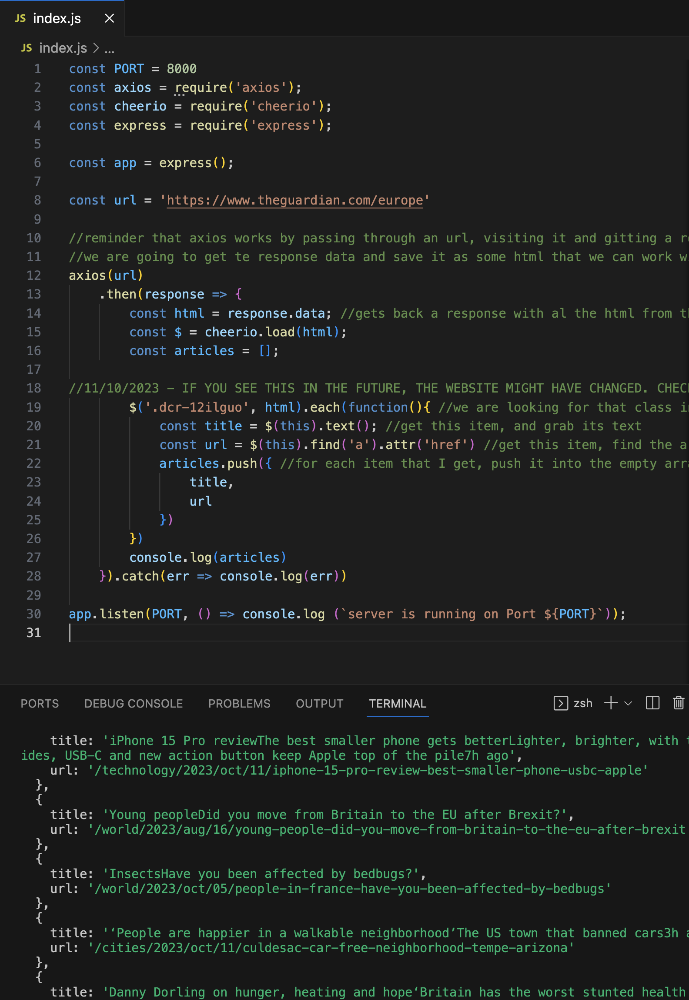

# web-scrapper

<h2>"Web scraping, web harvesting, or web data extraction is data scraping used for extracting data from websites."</h2> 

<h3>Built with: JavaScript, ExpressJs, NodeJs, and packages Axios and Cheerio.</h3>

<h3>First time with Cheerio? Same for me, so here's a brief summary: 'Cheerio parses HTML/XML into a navigable structure (DOM) for manipulation. It's ideal for web scraping and server-side tasks, but doesn't execute JavaScript or load external resources.'</h3>

If you are checking this repo after oct 2023 and this code does not work, try changing the class ( line 19) for one that suits your need. The website might have changed.

<i>*Based on tutorial by Code With Ania Kubów*</i>

<h2> Here is the final result:</h2>

